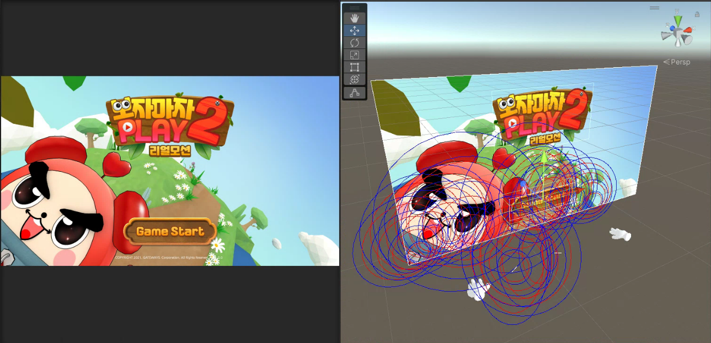
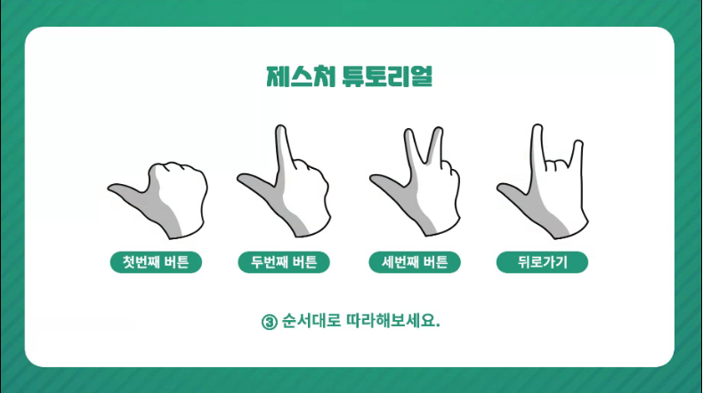
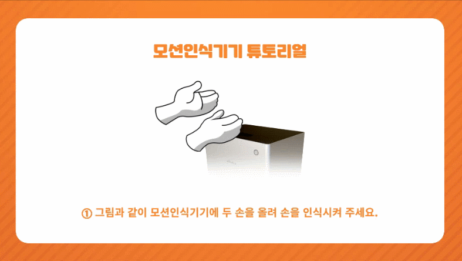

# 🎮 보자마자 PLAY2 리얼모션 (Bojamaja PLAY2 Real Motion)

<p align="center">
  
</p>

Leap Motion 제스처 인식 기반의 **캐주얼 게임 모음집**.
손동작으로 직접 조작하며 몰입형 게임 경험을 제공합니다.
업데이트로 **클래식 모드 / 랭킹 모드**가 추가되어 기존보다 확장된 게임성을 지원합니다.

- 각 게임은 30초 동안 진행되며, 클래식 모드 / 랭킹 모드 두 가지 방식으로 플레이 가능합니다.
- 순차적인 미션 구조, 손 동작 튜토리얼, 랭킹 등록 시스템, 별점 시스템, 사운드 및 이펙트 처리까지 포함된 종합형 콘텐츠입니다.
---

## 📅 개발 정리

| 구분             | 내용                                                                                                                                                        |
| -------------- | --------------------------------------------------------------------------------------------------------------------------------------------------------- |
| **개발 기간 / 역할** | **2022.01 \~ 2022.07 (7개월)**<br>팀 프로젝트 (개발 3명)<br>UI/게임 로직/랭킹 시스템/제스처 인식 통합 개발                                                                            |
| **플랫폼**        | Windows + Leap Motion 전용 키오스크                                                                                                                             |
| **기술 스택**      | Unity3D (C#)<br>Leap Motion SDK<br>Firebase 기반 순위 관리<br>모션 인식 기반 제스처 매핑                                                                                   |
| **주요 기여**      | - Leap Motion 제스처 매핑 (버튼, 선택, 조작)<br>- 랭킹 모드 시스템 (10개 랜덤 게임 → 총점 → 랭킹 등록)<br>- 클래식 모드 (별점 보상 시스템)<br>- UI/UX 흐름 설계 (튜토리얼 포함)<br>- Firebase 연동 및 점수 저장, 조회 |
| **성과**         | - Leap Motion 기반 몰입형 인터랙션 구현<br>- 단일 앱에 10종 이상의 모션 게임 통합<br>- 글로벌 랭킹 지원 및 확장성 확보                                                                          |

---

## ⚙️ 코드 구조 및 주요 클래스

| 클래스 이름                  | 설명                                                       |
| ----------------------- | -------------------------------------------------------- |
| `GestureManager.cs`     | Leap Motion 입력값(손가락, 손바닥)을 제스처 이벤트로 매핑. UI 버튼/게임 조작과 연동. |
| `GameFlowManager.cs`    | 전체 게임 흐름 제어 (메인 → 모드 선택 → 게임 실행 → 결과 → 랭킹 등록).           |
| `RankingManager.cs`     | Firebase 연동, 점수 저장/조회, 글로벌 랭킹 UI 반영.                     |
| `ClassicModeManager.cs` | 개별 게임 점수 계산 및 별(★) 보상 시스템 관리.                            |
| `TutorialManager.cs`    | 제스처/모션 인식 튜토리얼 로직 (손가락 버튼, 모션 인식기 사용법 안내).               |
| `UIManager.cs`          | 메뉴, 게임 선택, 결과창 UI 전환 및 애니메이션 제어.                         |

```csharp
// 제스처 인식 예시
if (leapHand.IsPinching())
{
    GestureManager.OnSelect();  // 제스처 → 버튼 클릭으로 매핑
}
```

```csharp
// Firebase 랭킹 저장 예시
FirebaseDB.Instance.SaveScore(userId, totalScore, () =>
{
    Debug.Log("랭킹 등록 완료");
});
```

---

## ✋ 제스처 & 튜토리얼

| 제스처 인식 예시                                                 | 설명                                           |
| --------------------------------------------------------- | -------------------------------------------- |
|  | 손가락 제스처를 버튼 입력으로 매핑 (첫번째 버튼, 두번째 버튼, 뒤로가기 등) |
|   | 모션 인식기에 손을 올려 제스처 인식 시작                      |

---

## 🎮 게임 모드 소개

| 모드         | 설명                                              |모드 |
| ---------- | ----------------------------------------------- |
| **클래식 모드** | 원하는 게임을 골라 30초 동안 플레이, 획득 점수에 따라 별(★) 부여        | |
| **랭킹 모드**  | 10개 미니게임을 랜덤 순서로 30초씩 플레이, 총 점수를 기반으로 글로벌 랭킹 등록 | |

---

## 📸 게임 화면 & 시연

| **타이틀 화면**                                          | **게임 선택**                                            | **랭킹 등록**                                          | **결과 화면**                                            | **랭킹 존**                                          |
| --------------------------------------------------- | ---------------------------------------------------- | -------------------------------------------------- | ---------------------------------------------------- | ------------------------------------------------- |
|  |  |  |  |  |

